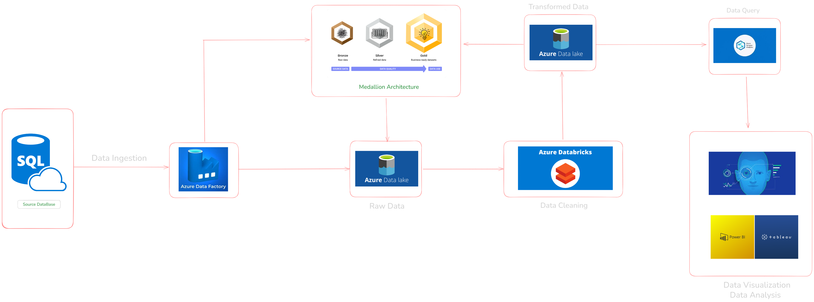

# Big-Data-Medallion-Architecture-on-Azure-for-ETL-Analytics
---

## Project Description :

Cloud-Native Big Data ETL Pipeline using Medallion Architecture (Bronze–Silver–Gold). Ingests raw data from cloud sources, processes via ETL/ELT in Databricks & DBT, orchestrated with Data Factory, and delivers clean, analytics-ready datasets stored in a scalable data lake.

---
## Project Flow and Architecture :

